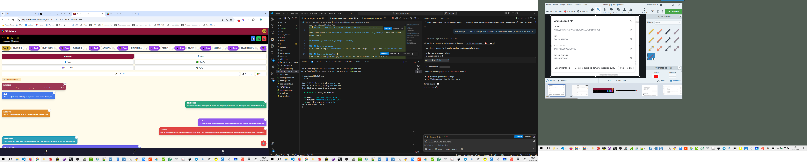

# 💡 Guide : Coaching IA pour votre jeu d'acteur

Vous avez accès à un **coach de théâtre alimenté par une IA (Gemini)** pour améliorer votre jeu !

## Comment ça marche ? (4 étapes simples)

### 1️⃣ Ouvrez un script

Allez dans l'onglet **Maison** → cliquez sur un script → cliquez sur **Lire le texte**

### 2️⃣ Repérez le bouton 💡

À côté de chaque personnage, vous verrez un petit bouton **💡** en violet

### 3️⃣ Cliquez sur 💡

Une fenêtre s'ouvre. Elle vous demande :

- **"Comment avez-vous prévu de jouer ce personnage ?"**
- Décrivez brièvement votre approche :
  - _"Je la joue plutôt timide et fragile"_
  - _"Je veux qu'il soit très énergique et comique"_
  - _"Elle doit être mystérieuse"_

### 4️⃣ Recevez les suggestions

L'IA génère **5-7 conseils de jeu** :

- 🎭 Techniques de jeu (Stanislavski, voix, corps...)
- 🎬 Indications de mouvement et mouvements scéniques
- 💬 Suggestions d'intonation
- 💭 Conseils psychologiques sur le personnage

## Le coût

✅ **C'est très peu cher** : environ **0,02€ par suggestion**

Une suggestion coûte moins qu'une gorgée de café ☕

> **Exemple :** Si vous générez **100 suggestions assez détaillées**, cela coûte environ **2€**

## Vous pouvez...

✅ **Régénérer** → Relancer une génération avec le même contexte  
✅ **Modifier votre approche** → Changer votre description et redemander  
✅ **Sauvegarder comme note** → Les suggestions deviennent des notes permanentes dans votre profil

## En cas d'oubli du coût... 💰

Si vous dépassez **5€ de suggestions** en une seule session, une alerte s'affiche :
_"⚠️ Vous avez dépensé 5,20€ en suggestions. Voulez-vous continuer ?"_

Cela vous protège contre les mauvaises surprises !

## Questions fréquentes

**Q: Pourquoi l'IA parfois ne marche pas ?**  
R: Si vous voyez _"API Gemini non configurée"_, rafraîchissez la page ou contactez l'administrateur.

**Q: Mes suggestions sont sauvegardées ?**  
R: Oui ! Cliquez sur **"Sauvegarder comme note"** dans la fenêtre coaching et elles deviennent des notes permanentes.

**Q: Je peux utiliser cette feature hors-ligne ?**  
R: Non, vous devez être connecté à Internet. C'est une feature en ligne.

**Q: L'IA donne toujours de bons conseils ?**  
R: L'IA est un outil d'aide. Elle connaît la théorie, mais **vous êtes l'artiste**. Si un conseil ne vous plaît pas, ignorez-le !

---

**Bon coaching ! 🎭** Régalez-vous à explorer votre personnage !
